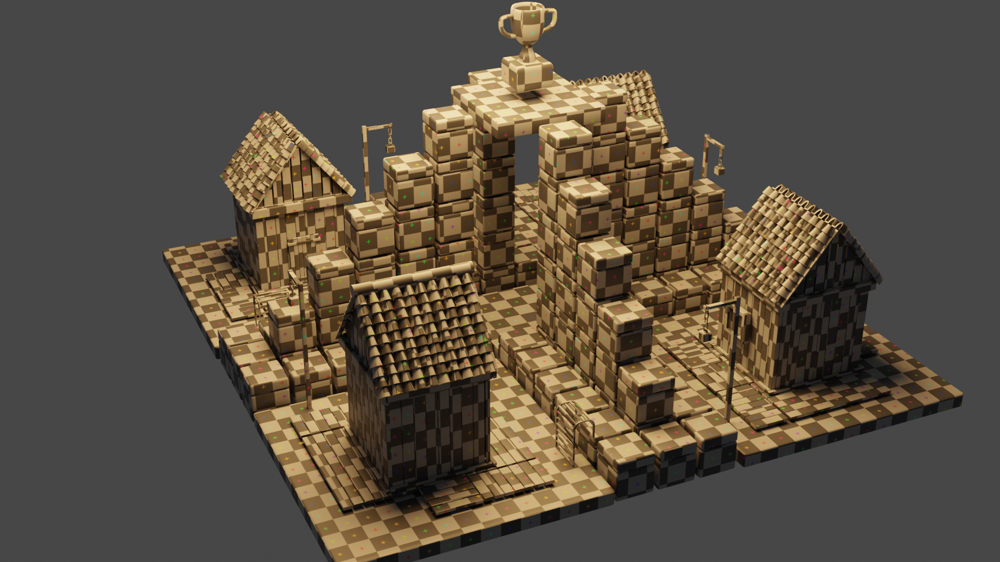
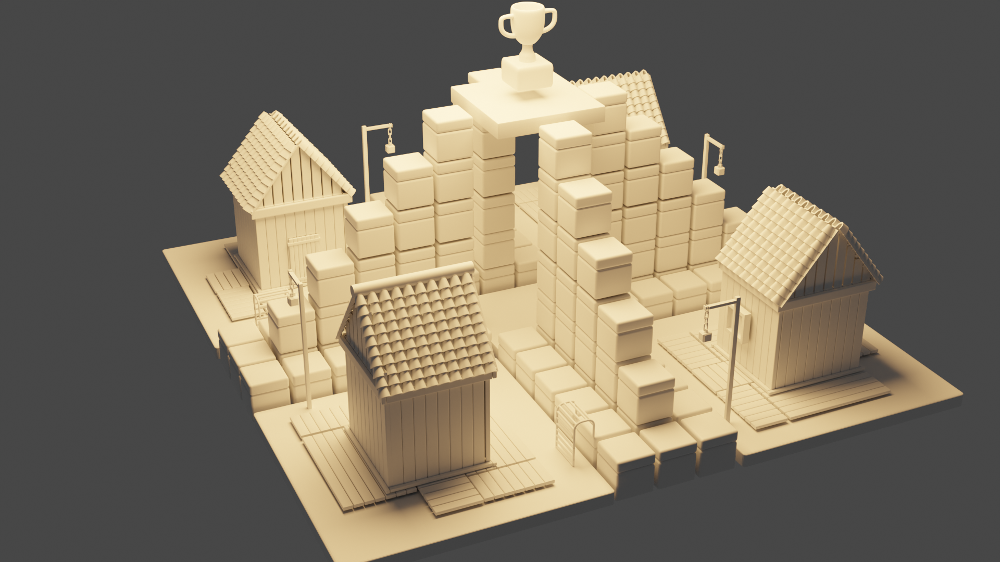
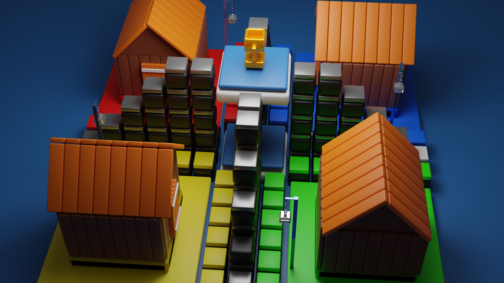

# DICE[3D]

Classical multiplayer game ludo recreated in THREE.JS with complex mathematical calculations of XYZ euler angles , quaternions and other calculations. 

## Table of Contents
- [Installation](#installation)
- [Usage](#usage)
- [Features](#features)
- [Contributing](#contributing)
- [License](#license)

## Installation

git clone '/path'
npm install 
npm run dev

## Usage

1. double click on screen to rollup the dice .
2. select the active token
3. ready to play

### Screenshots/Illustrations

Include some screenshots or illustrations showcasing your project in action.

## Features

List the key features of your project.

## Contributing

Explain how others can contribute to your project. Include guidelines for pull requests and code formatting.

## License

Include the license under which your project is distributed.

---

## Author

Your Name

## Acknowledgments

Mention any contributors, open-source libraries used, or any other acknowledgments.

## Support

If you need help with the project, contact email@example.com.

